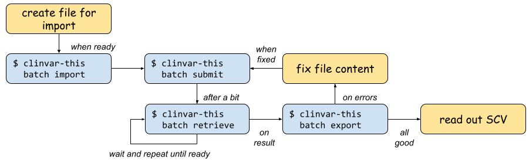

=============
ClinVar This!
=============

``clinvar-this`` is a Python-based software for the easy submission of variants to ClinVar.

When reading this online, you can use the navigation bar to the left to find your way around.
Otherwise, the following are good entry points:

- :ref:`getting_started`
- :ref:`api_vs_cli`
- :ref:`usage_cli`

.. toctree::
    :hidden:
    :maxdepth: 1
    :caption: Contents

    installation
    getting_started
    api_vs_cli
    usage_library
    usage_cli
    file_formats
    limitations
    common_errors

.. toctree::
    :hidden:
    :maxdepth: 1
    :caption: Project Info

    contributing
    authors
    history

.. toctree::
    :hidden:
    :maxdepth: 1
    :caption: CLI

    cli

.. toctree::
    :hidden:
    :maxdepth: 1
    :caption: API

    clinvar_api/modules
    clinvar_api/clinvar_api
    clinvar_api/clinvar_api.msg
    clinvar_api/clinvar_api.models

    clinvar_this/modules
    clinvar_this/clinvar_this

Indices and tables
==================
* :ref:`genindex`
* :ref:`modindex`
* :ref:`search`
