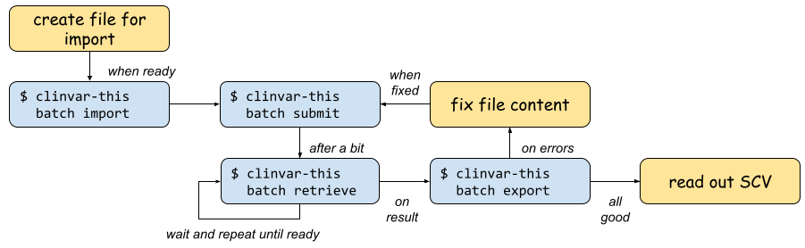

.. _usage_cli:

==================
Command Line Usage
==================

This section provides more "reference manual" style documentation when compared with :ref:`getting_started`.

After installation, you can run ``clinvar-this``:

.. code-block:: console

    $ clinvar-this --help

    usage: clinvar-this [-h] [--verbose]

    options:
      -h, --help  show this help message and exit
      --verbose   Enable more verbose output

--------
Workflow
--------

The following figure shows the overall workflow when using clinvar-this.

- You start out by creating a file for import.
- You then import the data into a local repository batch with ``clinvar-this batch import``.
- You can then post the data to the ClinVar API with ``clinvar-this batch submit``.
- The server will process your data in the background.
  You can query the current result with ``clinvar-this batch retrieve``.
  If this does not return yet, try again.
- Otherwise, you can export the current state of the batch with ``clinvar-this batch export`` to a TSV file.
- When there are errors, fix the variants to be submitted and re-submit with ``clinvar-this batch submit``.
- If everything runs to your liking, read out your ClinVar SCV identifier.

Note that the NCBI ClinVar server process runs the checks in several steps.
If an earlier step fails, you will not see the results of later checks.
Also, when processing runs longer this meansn that more steps succeeded so waiting longer is a good thing.

-------------
Configuration
-------------

The configuration will be stored in ``~/.config/clinvar-this/config.toml`` in `TOML format <https://toml.io/en/>`__.
The file can have multiple sections, each one configuring a **profile**.
You should probably configure a ``default`` profile.
You can set values using ``clinvar-this config set NAME VALUE`` and read values with ``clinvar-this config get NAME``.
A minimal configuration file looks as follows:

.. code-block:: toml

    [default]
    auth_token = "01234567890abcdefghijklm0987654321"

Before you can use ``clinvar-this`` for the first time, you have to configure the API token to use with the ClinVar submission API.

.. code-block:: console

    $ clinvar-this set auth_token YOURTOKENHERE

Note that configuration values will be shown in full when using ``varfish-cli config get/set``.
Subsequently when using the tool for API submission, it will only show the first 5 characters of the secret key.
This allows to determine whether the right key is used but the value is safe enough to go to local log files etc.
However, you should still ensure to take appropriate care when exposing these 5 first characters as applicable.

----------------
Local Repository
----------------

clinvar-this creates a local repository of data in ``~/.local/share/clinvar-this/$profile`` where ``$profile`` is the name of the profile that you use.
Below this path, you will find one directory for each submission that you manage.
Each such submission directory contains the following files:

``payload.$timestamp.json``
    The payload (to be) sent to ClinVar API server at the given timestamp.
    The lexicographically largest file is the latest one.

    On each import, a new payload file will be created.
    If a previous one exists, the latest one will be merged with the new to-be-imported data.
    Also, when the NCBI server returns SCV identifiers on success or failures, this information will be stored in a new payload file.

    You can safely manipulate these JSON files but that will require some knowledge about the ClinVar API format.
    However, it really is not hard and with some ClinVar/bioinformatics experience, you will be able to figure it out.

``submission-response.$timestamp.json``
    The response returned by the ClinVar API server returned at the given timestamp on submission.
    There is no direct correlation between the payload and submission response files at the moment, but you probably can figure it out based on the timestamp.

``retrieve-response.$timestamp.json``
    The response returned by the ClinVar API server when calling ``batch retrieve BATCH``.

You can specify submission names when creating them (which is recommended).
Otherwise, a name will be created for you based on the current date and time.

------------
File Formats
------------

See the dedicatd section :ref:`file_formats`.
